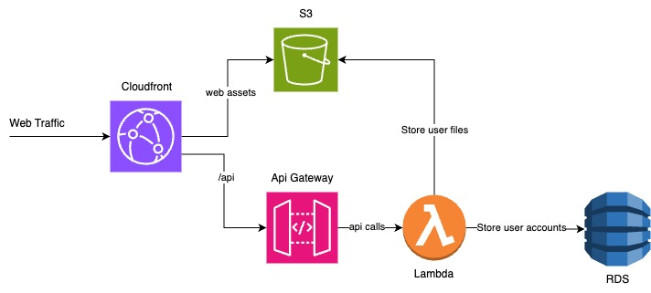

# flopbox

## !! Flopbox is an intentionally vulnerable application used to teach about Cloud Security and therefore contains critical vulnerabilities. Host with caution! !!

Flopbox is a cloud storage solution. It allows users to create accounts and to upload and download files.

## Code Structure

Flopbox's code consists of three major directories:

- **infrastructure** contains the CDK code used to spin up Flopbox's Cloud infrastructure
- **lambda** contains code for a Lambda function which implements Flopbox's API
- **webpage** contains the Flopbox frontend

## Architecture



## Deploying

Make sure you have sufficient AWS permissions to perform the deployment and that the AWS access credentials are available in your env.

1. To build the lambda code, run the following commands in the lambda directory

```
npm i
npm run build
```

2. To deploy Flopbox's Cloud infrastructure (including the lambda), run the following commands in the infrastructure directory

```
npm i
npx cdk deploy
```

3. To build and deploy the webapp, run the following commands in the webpage directory

```
npm i
npm run build
npm run deploy
```
